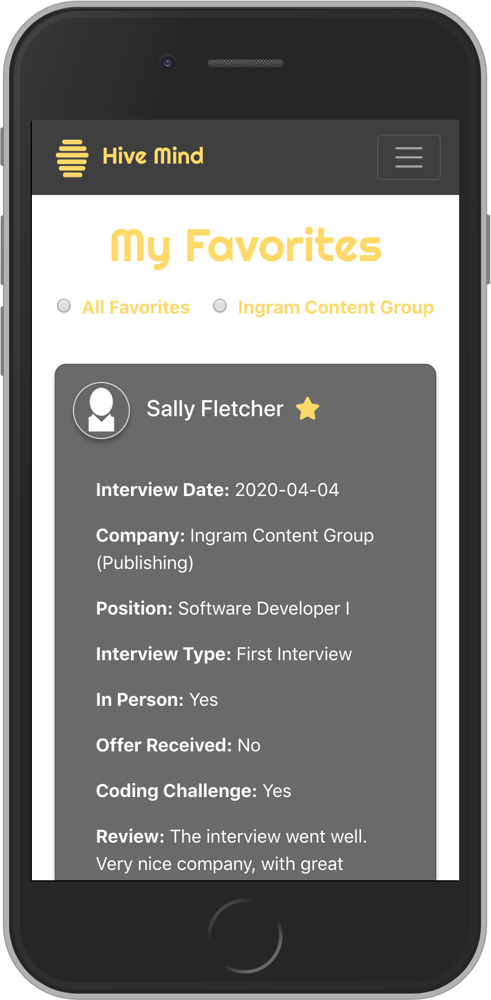
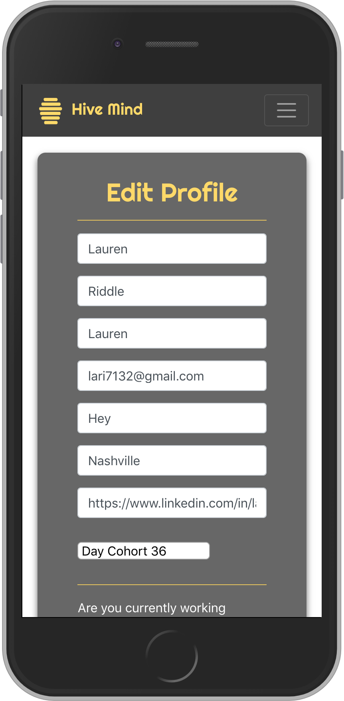
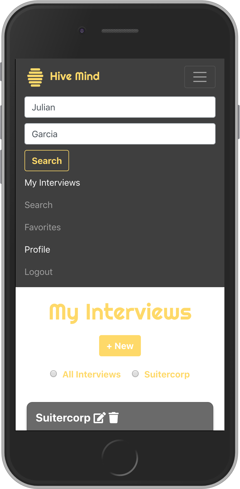
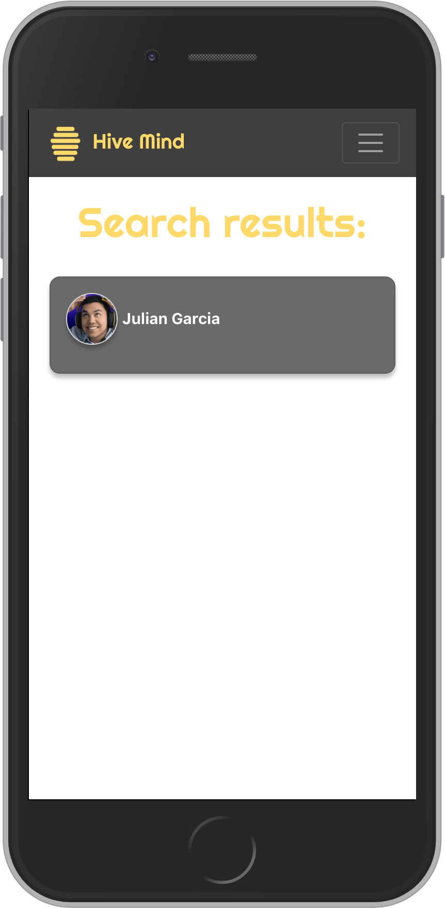

## What is Hive Mind?
Hive Mind is a social media platform that allows Nashville Software School students and alumni to create and share interview "surveys" for interviews that they have had with specific companies. These surveys include information that can be used by students to prepare for their own interviews with specific companies. With Hive Mind, students are able to create their own interview surveys, search for other student's interview surveys by company, save other user's surveys to a favorites board, customize personal profile information, and view other's profiles. 

## Why was Hive Mind created?
As a student who is about to graduate, when the job search process began, one thing that I quickly realized is that it can be hard to know exactly how to prepare for interviews with different companies. Each company has a different way of interviewing, different questions that they ask, and different code challenges and trying to guess the best way to prepare for these interviews can be nerve wracking. This is why I decided to create Hive Mind - a solution to ease the stress that students face during their job search by helping them feel more prepared for the interview process.

## Want to use Hive Mind? Follow the instructions bellow to set up the application.

1. If you haven't already done so, please go to the API for this app and complete the setup instructions, then return here and complete the client-side setup to start the app. The API can be found here: https://github.com/laurenriddle/Hive-Mind-Back-End-Capstone-Api
1. Clone down this repository by clicking the "Clone or Download" button above, copying the SSH key, and running the following command in your terminal `git clone SSHKEYGOESHERE`.
1. `cd` into the root directory of the app.
1. Run `npm install` and wait for all dependencies to be installed.
1. `cd` into /src/modules and open the Credentials.js.example file.
1. You must sign up for a Cloudinary account (https://cloudinary.com/) and get your own Cloudname and Upload preset to use the image upload functionality in this app. Once you login to Cloudinary, your cloud name will be at top of the dashboard page and your upload preset will be under settings > upload > upload preset. You will need to use the unsigned preset.  
1. Once you have your cloud name and upload preset, copy and paste them into the appropriate spot in the Credentials.js.example file.
1. Remove the .example extension from the Credentials.js.example file.
1. Run `npm start` to verify that installation was successful and start the application.
1. Go to http://localhost:3000/ to view the app. 

## How do you use Hive Mind? 

1. After completing the setup above, in the browser, navigate to http://localhost:3000.
2. If you are a returning user, login to Hive Mind with your account information. 
3. Never signed up for Hive Mind before? No problem! Click the register a new account link and complete your registration. 
4. Now that you are logged in, you will be taken to the home page. From here, you can choose to search for interviews by company, create a new interview survey, or you can click on the navigation bar at the top of the page and choose to view your favorites, view your interviews, view your profile, or search for other user's profiles. 

&nbsp&nbsp&nbsp&nbsp&nbsp&nbsp&nbsp&nbsp

5. If you choose to create an interview, you will be taken to the new interview form (Note: If you do not see the company that you want in the companies dropdown, click the "Add a company" link to add it to the database). Once you have filled out the form and submitted it, you will be taken to the "My Interviews" page that displays a list of interview surveys you have created. When you are viewing your interviews, you will be able to filter them by company using the filter buttons and you will also be able to select the "New" button to create another survey.

&nbsp&nbsp&nbsp&nbsp&nbsp&nbsp&nbsp&nbsp

6. If you choose to search interviews by company, you will be taken to a page with an input. Type the name of the company you want to search for into the input box and click the search button. If the company that you want is in the database, it will appear in the search results. To view the interviews for that company, click the company name to go to the company details page. Once you are on the company details page, you will be able to view and favorite interviews for that company.

&nbsp&nbsp&nbsp&nbsp&nbsp&nbsp&nbsp&nbsp

7. If you choose "Favorites" from the navigation bar, you will be presented with a list of your favorited interviews and buttons to filter them by company. Click the star on any of the favorite cards to delete that favorite and click any of the filter buttons to filter favorites by company.  

8. If you choose "Profile" from the navigation bar, you will be taken to a view of your profile information with an button that allows you to edit it. Click the edit button to make changes to your profile. 

&nbsp&nbsp&nbsp&nbsp&nbsp&nbsp&nbsp&nbsp

9. If you wish to view another user's profile and the interview surveys that they have created, you can enter their name into the form in the navigation bar and select search. The search results will show up below the navbar. Click on the user's name to view their profile and interviews.

&nbsp&nbsp&nbsp&nbsp&nbsp&nbsp&nbsp&nbsp&nbsp&nbsp&nbsp&nbsp&nbsp&nbsp&nbsp&nbsp

## What's next for Hive Mind?
Coming soon to Hive Mind will be the ability for user's to message each other privately or publicy so that they can chat about interviews, companies, and their job searches. User's will also be able to follow each other and see a feed of the posts that have been created by the people they are following. 

## Hive Mind Documentation 

### Entity Relationship Diagram

### Mockups

### Tech Stack 

&nbsp&nbsp&nbsp&nbsp&nbsp&nbsp&nbsp&nbsp&nbsp&nbsp&nbsp&nbsp&nbsp&nbsp&nbsp&nbsp&nbsp&nbsp&nbsp&nbsp&nbsp&nbsp&nbsp&nbsp&nbsp&nbsp&nbsp&nbsp&nbsp&nbsp&nbsp&nbsp&nbsp&nbsp&nbsp&nbsp&nbsp&nbsp&nbsp&nbsp

&nbsp&nbsp&nbsp&nbsp&nbsp&nbsp&nbsp&nbsp&nbsp&nbsp&nbsp&nbsp&nbsp&nbsp&nbsp&nbsp&nbsp&nbsp&nbsp&nbsp&nbsp&nbsp&nbsp&nbsp&nbsp&nbsp&nbsp&nbsp&nbsp&nbsp&nbsp&nbsp

©2019 - Lauren Riddle
